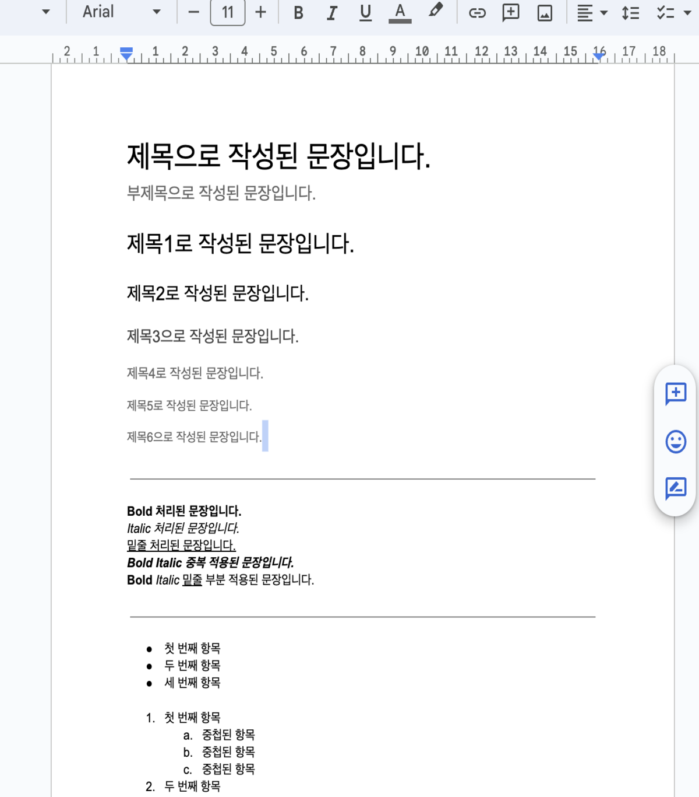

# W2M

<p align="center">
  
</p>

### W2M(Word 2 Markdown)은 워드(docx)문서를 xml태그로 분리하고 해당 xml의 구성 태그를 분석하여 마크다운으로 변경해주는 웹 애플리케이션 입니다.

## **🔗 Link**

[Word2Markdown service](https://word2markdown.com/)

<br></br>

# 📕 Contents

- [🔎 Preview](#🔎-preview)
- [🙋🏻 Motivation](#🙋🏻-motivation)
- [🧗🏻 Challenges](#🧗🏻-challenges)
  1. [어떻게 워드문서를 마크다운으로 변경 할 수 있을까?](#1-어떻게-워드문서를-마크다운으로-변경-할-수-있을까)
  - [DOCX 문서, XML 구조의 이해](#1-1-docx-문서-xml-구조의-이해)
  - [XML 태그 분석](#1-2-xml-태그-분석)
  - [XML 마크다운 변환](#1-3-xml-마크다운-변환)
  2. [document.xml 문서만으로 변환이 어려운 부분은 어떻게 변경을 해야했나?](#2-documentxml-문서만으로-변환이-어려운-부분은-어떻게-변경을-해야했나)
  - [하이퍼링크 처리](#2-1-하이퍼링크-처리)
  - [리스트 처리](#2-2-리스트-처리)
  3. [추출한 이미지는 어떻게 변경해줄까?](#3-추출한-이미지는-어떻게-변경해줄까)
  - [Base64로 인코딩처리하는방법](#3-1-base64로-인코딩처리하는방법)
  - [S3에 이미지를 저장하고 경로를 받아 처리하는방법](#3-2-s3에-이미지를-저장하고-경로를-받아-처리하는방법)
  - [이미지 압축하여 저장후 상대경로 지정하여 처리하는 방법](#3-3-이미지-압축하여-저장후-상대경로-지정하여-처리하는-방법)
  - [이미지 처리 방법 선택](#3-4-이미지-처리-방법-비교-및-선택)
  - [상대경로 이미지를 프리뷰로 어떻게 보여줄까](#3-5-상대경로-이미지를-프리뷰로-어떻게-보여줄까)
  4. [어떻게하면 자연스럽게 스크롤을 연동 시켜줄수 있을까?](#4-어떻게-하면-자연스럽게-스크롤을-연동-시켜줄수-있을까)
  - [최상단을 기준으로 동기화](#4-1-최상단을-기준으로-동기화)
  - [에디터와 프리뷰의 비율을 기준으로 동기화](#4-2-에디터와-프리뷰의-비율을-기준으로-동기화)
  5. [마크다운 툴바는 어떻게 구현할까?](#5-마크다운-툴바는-어떻게-구현할-수-있을까)
  - [선택된 텍스트 확인 방법](#5-1-텍스트가-선택-됐는지는-어떻게-알수있을까)
  - [텍스트 앞뒤에 오는 문법 처리](#5-2-텍스트의-앞뒤에-오는-문법)
  - [문장의 맨 앞에 오는 문법 처리](#5-3-텍스트의-앞에-오는-문법)
- [🛠 Tech Stacks](#🛠-tech-stacks)
- [📆 Project timeline](#📆-project-timeline)
- [🕹️ Features](#🕹️-features)
- [💭 Memoir](#💭-memoir)

<br />
<br />

# 🔎 Preview

<details>
<summary>워드 문서 업로드</summary>

</details>

<details>
<summary>워드 문서 마크다운으로 변환</summary>

</details>

<details>
<summary>마크다운 에디터</summary>

</details>

<br />
<br />

# **🙋🏻 Motivation**

제 전직장 경험을 통해, 다양한 팀 간 협업은 업무의 필수적 부분임을 깨달았습니다. 특히 워드 파일이 업무 공유와 문서 작성에서 중추적인 역할을 한다는 사실을 목격했습니다. 기획팀 등 다른 부서와의 협업에서 워드 파일 교환은 일상적인 일이었습니다.

개발 프로세스에서 문서 관리와 협업은 필수적입니다. 문서 형식은 다양한 팀 간의 원활한 정보 공유에 중요한 역할을 합니다. 이러한 맥락에서, 개발자 커뮤니티 내에서는 구조가 간단하고, 버전 관리 시스템과 호환되며, 웹 기반 플랫폼에서의 활용성이 높은 마크다운 형식이 선호됩니다.

이에 따라, 워드 파일을 마크다운으로 자동 변환할 수 있는 도구의 필요성을 느끼게 되었습니다. 이 도구는 개발자들이 자신의 작업 흐름을 유지하며, 비개발 팀과의 문서 기반 협업을 더욱 효율적으로 진행할 수 있도록 도와줄 것입니다.

또한 문서 변환작업에서 맘모스나 팬독 같은 기존 변환 라이브러리 대신, 직접 워드 파일을 분석하고 변환하는 과정을 통해, 더 깊이 있는 문서 처리 능력을 개발하고자 하는 챌린지를 설정하여 복잡한 문서 구조와 서식을 보다 정확하게 처리할 수 있는 기능을 개발하는 데 중점을 두었습니다.

이 프로젝트는 사용자들이 워드 문서와 마크다운 형식 간의 전환을 원활하게 할 수 있도록 지원함으로써, 문서 작업의 유연성을 향상시키고, 개발자들이 기존 문서 형식에 구애받지 않고 집중할 수 있는 환경을 조성하는 데 기여할 것이라 판단하여 해당 프로젝트를 기획하게 되었습니다.

<br />
<br />

# **🧗🏻 Challenges**

## 1. 어떻게 워드문서를 마크다운으로 변경 할 수 있을까?

<p align="center">
  
</p>

### 1-1. DOCX 문서, XML 구조의 이해

DOCX 파일은 다양한 XML들로 이루어져 있으며, 이를 마크다운으로 변환하기 위해서는 DOCX 파일을 각각의 XML 파일로 압축을 해제하고 분석하여 해당 정보를 마크다운 형식으로 변경해주여야 했습니다.
압축을 해제한 각 XML 태그를 마크다운 문법에 맞게 변환하는 로직을 구현하기 위해서 가장 먼저 진행해야할 부분은 DOCX 문서에서 생성된 XML 태그들이 각각 어떤 속성을 가지고 있는지 자세히 알아야 할 필요가 있었습니다.
이에 저는 실제 문서 내용을 담고 있으며, 텍스트와 문서의 구조를 정의하는 document.xml을 기준으로 태그를 분석하였습니다.

<br />

### 1-2. XML 태그 분석

document.xml 파일은 문서의 본문 내용을 담고 있으며, XML 형식으로 구조화되어 있습니다. document.xml 파일의 구조와 내용을 이해하고 활용하면, Word 문서를 프로그래밍적으로 효율적으로 다룰 수 있습니다. 이를 통해 문서 자동화 작업을 간편하게 수행하고, 다양한 형식 간의 변환 작업을 효과적으로 처리할 수 있습니다.
document.xml에서 문서의 구조를 나타내는 주요태그들은 아래와 같습니다.

- `<w:body>` : 문서의 본문을 나타내는 요소입니다. 실제 문서의 내용이 이 안에 위치합니다.
- `<w:p>` : (Paragraph) 문단을 나타내는 태그입니다. 텍스트의 블록을 구분합니다.
- `<w:t>` : (Text) 텍스트 런 안의 실제 텍스트 내용을 포함합니다.
- `<w:r>` : (Run) 문단 내의 텍스트 런을 나타냅니다. 스타일이나 속성이 달라지는 텍스트의 단위입니다.
- `<w:pStyle>` : 문단 스타일을 정의합니다. w:val 속성을 통해 스타일의 이름(예: Heading1, Title 등)을 지정합니다.
- `<w:rPr>` : 실행 속성(Run Properties)을 정의합니다. 글꼴, 크기, 색상 등 텍스트 스타일 관련 속성을 포함합니다.
- `<w:hyperlink>` : 하이퍼링크 속성을 가지고있음을 정의합니다. document.xml에서는 해당 요소가 하이퍼링크 속성을 가진다는것만 확인 가능 하고, .rels파일과 파싱하여 해당 id와 동일한 아이디를 같는 요소의 target값에 링크 주소를 확인 할 수 있습니다.
- `<w:numpr>` : 리스트(넘버링)를 시작합니다. 리스트를 감싸주는 요소로 해당 태그내에 리스트 요소가 있습니다.
- `<w:numId>` : 리스트(넘버링)의 id를 나타내고 해당 요소의 값에 따라 값이 같으면 하나의 리스트로 묶인다.
- `<w:tbl>` :테이블을 시작합니다. 테이블이 존재할경우 테이블을 감싸주는 요소로 해당 태그내에 테이블 요소가 있습니다.
- `<w:tblPr>` : 테이블의 속성들을 정의합니다.
- `<w:drawing>` : 문서 내에 그림(이미지)을 포함하는 데 사용되는 태그입니다.

위의 태그들을 중심으로, 각각 내부 태그들의 속성들을 확인하여 Markdown으로 변환하는 로직을 구성하였습니다. 이를 통해 문서 내의 구조와 스타일을 유지하면서도 마크다운 형식으로 손쉽게 변환할 수 있습니다.

<br />

### 1-3. XML 마크다운 변환

document.xml를 기준으로 마크다운으로 변환해주는 로직에 대해 고민하였고 노드를 순회하면서 해당 노드가 텍스트를 담고 있는 w:t 태그인지 확인하여 아니라면, 태그의 종류를 확인하여 해당 태그의 속성을 처리한 뒤, 자식 노드로 내려가 이 과정을 반복합니다. 태그가 텍스트 태그일 경우, 이전 태그들로부터 파생된 속성을 바탕으로 마크다운 문자열에 추가합니다. 이러한 과정을 통해 XML을 마크다운으로 체계적으로 변환하였습니다.

  <p align="center">
    
  </p>

```js
if (node.nodeType === 3 && node.textContent.trim()) {
  // 생략
  const content = `${headingLevel}${numberingLevel}${markdownSyntax}${node.textContent.trim()}${syntaxReverse}`;
  markdown += isListItem || depth === 0 ? `${content}` : `${content} `;
} else if (node.nodeType === 1) {
  if (node.nodeName === "w:p") {
    if (!markdown.endsWith("\n\n")) {
      markdown += "\n";
    }
    // 생략
  }

  for (const child of Array.from(node.childNodes)) {
    const childMarkdown = await printTextNodes(
      child,
      docxFilesData,
      "",
      depth + 1,
      newHeadingLevel,
      newNumberingLevel,
      newMarkdownSyntax,
      listItemCounters,
      isListItem,
      processedImages,
      addedImages,
    );
    markdown += childMarkdown;
  }
}
// 생략
```

<br />

## 2. document.xml 문서만으로 변환이 어려운 부분은 어떻게 변경을 해야했나?

### 2-1. 하이퍼링크 처리

document.xml 문서에는 해당 요소가 하이퍼링크 속성을 가지고 있다는 `<w:hyperlink>` 태그에 id값만 표기가 되고 연결된 url주소에 대한 정보를 확인할 수 없습니다.
하이퍼링크의 url 경로를 알기 위해서는 document.xml.rels 파일 내에서, `<Relationship>`를 순회하면서 각 id와 대응하는 타겟 URL을 연결하는 관계 맵을 구성합니다. 구성된 관계 맵에서 기존의 document.xml의 `<w:hyperlink>`의 태그 id를 이용하여 하이퍼링크의 URL 정보를 추출하고 마크다운 형식으로 변환하였습니다.

<p align="left">
  
</p>

```js
const relationships = xmlDoc.getElementsByTagName("Relationship");
const relationshipMap = {};

for (let relationship of relationships) {
  const id = relationship.getAttribute("Id");
  const target = relationship.getAttribute("Target");
  relationshipMap[id] = target;
}
```

<br />

### 2-2. 리스트 처리

아래 이미지와 같이 넘버링 이나 불릿 포인트 처리가 된 리스트들은 어떻게 변경을 해줘야할까?

<p align="left">
  
</p>

넘버링이나, 불릿 포인트 역시 하이퍼링크와 마찬가지로, document.xml 문서 내에서는 `<w:numId>` 태그를 통해 ID값만 표시됩니다. 해당 요소가 점 리스트인지 숫자 리스트인지를 판별하기 위해서는 numbering.xml 파일을 확인해야 합니다. 여기서 해당 ID가 numbering.xml 내에서 어떠한 ID를 가지는지 확인하고, `<w:numFmt>`를 통해 리스트의 형태를 파악할 수 있습니다. 리스트를 마크다운으로 변환하기 위해서는 먼저 numbering.xml에서 `<w:abstractNumId>` 태그별로 각 리스트의 형태를 매핑합니다. 이후 매핑된 객체를 `<w:numId>`와 연결하여 해당 리스트를 마크다운 형식으로 변환했습니다.

```js
for (let abstractNum of abstractNums) {
  const abstractNumId = abstractNum.getAttribute("w:abstractNumId");
  const lvls = abstractNum.getElementsByTagName("w:lvl");

  const levelsDefinition = {};

  for (let lvl of lvls) {
    const ilvl = lvl.getAttribute("w:ilvl");
    const numFmt = lvl
      .getElementsByTagName("w:numFmt")[0]
      .getAttribute("w:val");
    const lvlText = lvl
      .getElementsByTagName("w:lvlText")[0]
      .getAttribute("w:val");
    levelsDefinition[ilvl] = { numFmt, lvlText };
  }

  abstractNumIdToDefinition[abstractNumId] = levelsDefinition;
}

const numIdToDefinition = {};

for (let num of nums) {
  const numId = num.getAttribute("w:numId");
  const abstractNumIdRef = num
    .getElementsByTagName("w:abstractNumId")[0]
    .getAttribute("w:val");

  numIdToDefinition[numId] = abstractNumIdToDefinition[abstractNumIdRef];
}
```

<p align="left">
  
</p>

<br />

## 3. 추출한 이미지는 어떻게 변경해줄까?

DOCX 문서에 포함된 이미지를 추출한 뒤에 마크다운에 해당 이미지를 어떻게 삽입할지에 대해서 3가지 방법을 고민하였습니다.

### 3-1. Base64로 인코딩처리하는방법

가장 먼저 생각했던 방식은 Base64를 이용해서 이미지를 먼저 인코딩한 뒤에 해당 이미지를 마크다운 경로에 삽입하는 방식이였습니다.

``

<p align="left">
  
</p>

**Base64 사용시 장점**

Base64 인코딩된 이미지를 사용함으로써 문서는 외부 리소스에 대한 의존성 없이 자체적으로 이미지를 포함할 수 있습니다. 이는 문서를 이메일로 보내거나, 다른 플랫폼에서 공유할 때 특히 유용하며, 모든 이미지가 문서 내부에 포함되어 있기 때문에 파일 하나만으로도 완전한 문서를 제공할 수 있습니다.

예를들어 GitHub의 README.md 파일에 이미지를 삽입하고 싶지만, 외부 호스팅 서비스에 의존하고 싶지 않은 경우. Base64 인코딩을 사용하면 이미지가 README.md 파일 안에 직접 포함되므로, 파일만 있으면 언제 어디서나 동일한 방식으로 이미지를 볼 수 있습니다.

<br />

**Base64 사용시 단점**

Base64로 인코딩된 이미지는 아래와 같이 일반적으로 매우 긴 문자열로 표현됩니다. 이러한 긴 문자열은 마크다운 문서의 소스 코드를 직접 보거나 편집할 때 가독성이 매우 저하됩니다. 특히, 이미지가 많거나 인코딩된 문자열이 긴 경우 문서의 전체적인 관리가 어려워집니다.

<p align="left">
  
</p>

이미지를 인코딩 처리하는 경우 문서의 가독성과 관리 측면에서 나빠지는데 이는 사용자가 변환후에도 수정할 수 있게 마크다운 에디터 기능을 추가한 해당 프로젝트에서는 적합한 방법이 아니라고 판단하였습니다.

<br />

### 3-2. S3에 이미지를 저장하고 경로를 받아 처리하는방법

마크다운 에디터를 구현하면서 깃허브 마크다운 에디터를 많이 참고하였습니다. 이 방법의 경우 깃허브 마크다운 에디터에서 이미지를 드래그해서 드랍하면 해당 이미지가 저장소에 저장되고 이미지의 url경로가 삽입되는 형식에서 착안하여 추출한 이미지를 S3 저장소에 이미지를 저장하고 해당 이미지의 url경로를 반환받아 해당 경로를 마크다운에 삽입해주는 방식을 고민하였습니다.

``

**S3 사용시 장점**

이미지를 S3 같은 클라우드 스토리지 서비스에 호스팅함으로써, 마크다운 문서 자체의 크기를 크게 줄일 수 있습니다. 이는 문서를 더 빠르게 로딩하고, 전송 시간과 비용을 절감할 수 있게 해줍니다.

또한 사용자가 로컬에서 이미지를 마크다운 에디터로 드래그 앤 드롭하는 방식은 직관적이고 사용하기 쉽습니다. 이미지가 S3에 자동으로 업로드되고, 반환된 URL이 마크다운 문서에 삽입되면 사용자는 별도의 업로드 과정 없이 문서에 이미지를 추가할 수 있습니다. 이러한 편리성은 깃허브 마크다운 에디터에서 큰 장점으로 작용하며, 사용자 경험을 크게 향상시킵니다.

<p align="left">
  
</p>

<br />

**S3 사용시 단점**

다만 단점으로는 사용자가 업로드하는 이미지가 개인적인 정보나 민감한 데이터를 포함할 수 있습니다. 이는 데이터 보안 및 개인 정보 보호 관련 문제를 야기할 수 있으며, 이를 관리하기 위한 추가적인 정책과 시스템이 필요합니다.

또한 이미지 파일을 장기간 S3에 보유할 경우, 스토리지 비용이 증가할 수 있습니다. 마크다운 문서와 연결된 이미지의 사용 기간을 설정하고 관리하는 것이 어려울 수 있으며, 이는 비용 증가와 데이터 보유 정책의 복잡성을 초래합니다. 이러한 이슈는 클라우드 스토리지를 사용할 때 반드시 고려해야 할 중요한 요소입니다.

<br />

### 3-3. 이미지 압축하여 저장후 상대경로 지정하여 처리하는 방법

변환된 마크다운 문서에 포함된 이미지를 마크다운 파일과 함께 압축하여 제공하는 방법입니다. 이때, 마크다운 문서 내에는 이미지의 상대경로가 삽입됩니다.

``

**상대경로 처리시 장점**

해당 방식의 장점으로는 사용자의 이미지 데이터를 서버나 클라우드에 업로드하지 않음으로써 사용자의 데이터 프라이버시를 보호합니다. 사용자가 생성한 데이터는 사용자의 기기에만 남아 있으므로, 외부로의 데이터 유출 위험이 없습니다.
또한 마크다운 문서와 관련 이미지 파일이 하나의 압축 파일로 제공되므로, 사용자는 인터넷 연결 없이도 동일한 콘텐츠를 볼 수 있습니다. 이는 문서의 접근성을 크게 향상시킵니다.

<p align="left">
  
</p>

<br />

**상대경로 처리시 단점**

단점으로는 상대 경로를 사용함으로써, 이미지의 정상적인 표시 여부는 경로의 정확성에 의존합니다. 이는 파일 구조가 변경될 경우 이미지가 올바르게 표시되지 않을 가능성을 내포합니다.

### 3-4. 이미지 처리 방법 비교 및 선택

Base64를 사용해서 인코딩 처리하는 방법은 마크다운 에디터를 사용하기 때문에 프로젝트 성격에 맞지 않다고 판단하였다.<br />

또한 클라우드 스토리지 서비스를 사용하여 이미지를 호스팅하는 방법은 초기에는 간편하고 효율적일 수 있으나, 시간이 지남에 따라 비용이 누적될 수 있습니다. 특히, 대규모 문서와 이미지를 다루는 프로젝트의 경우, 저장 공간과 데이터 전송에 따른 비용이 상당할 수 있습니다.<br />

반면, 이미지를 압축하여 마크다운 문서와 함께 제공하는 방식은 추가 비용 없이 사용자가 자신의 데이터를 관리할 수 있게 합니다. 이 방법은 사용자가 필요에 따라 자유롭게 데이터를 배포하거나 삭제할 수 있는 유연성을 제공하고, 장기적으로 보았을 때 경제적인 이점을 제공합니다.<br />

또한 개인정보 보호는 현대 디지털 환경에서 매우 중요한 고려사항으로 S3 클라우드에 이미지를 업로드시 이미지 데이터에 사용자의 신원, 위치, 활동 등 민감한 정보가 포함될 경우 이러한 정보가 무단으로 유출되거나 악용될 위험이 있습니다.<br />

반면, 이미지를 사용자의 로컬 환경에서만 관리하고 외부 서버에 업로드하지 않는 방식은 데이터 유출의 위험을 최소화합니다. 이는 사용자가 자신의 데이터에 대한 완전한 통제권을 유지할 수 있게 하며, 높은 수준의 개인정보 보호를 가능하게 합니다.

위와 같은 이유로 이미지를 압축하여 저장 후 마크다운 문서에 상대경로로 삽입하는 방법을 선택하여 사용하였습니다.

<br />

### 3-5. 상대경로 이미지를 프리뷰로 어떻게 보여줄까

이미지를 마크다운 문서에 상대경로로 삽입하는 방법의 경우 당연하게도 프로젝트에서 구현한 마크다운에디터의 프리뷰에서는 해당 이미지가 보이지 않게됩니다.<br />
상대경로로 삽입된 이미지를 마크다운 에디터의 프리뷰에서 효과적으로 표시하는 방법은 사용자 경험을 향상시키는 중요한 요소입니다.<br />
프로젝트에서 구현한 마크다운 에디터에서 상대경로를 통해 삽입된 이미지가 웹페이지에서 읽히지 않는 문제를 해결하기 위해, 마크다운을 HTML로 변환할 때 이미지 경로를 조건적으로 처리하는 방식을 적용하였습니다. <br />
이 과정은 마크다운에서 HTML로의 변환을 담당하는 렌더러의 이미지 처리 방식을 커스터마이징함으로써 이루어집니다.

변환 과정에서, 렌더러는 먼저 이미지의 경로가 외부 URL인지 또는 상대경로인지를 판별합니다. 이를 위해, 이미지의 href 속성이 "http://" 또는 "https://"로 시작하는지를 확인하여 외부 URL인 경우와 그렇지 않은 경우를 구분합니다.

```js
renderer.image = function (href, title, text) {
  const isHttpUrl = href.startsWith("http://") || href.startsWith("https://");

  if (isHttpUrl) {
    return ``;
  } else {
    return `
      <div class="text-center image-container">
        
        <div class="text-xs text-gray-600">프리뷰를 위해 표시된 이미지입니다.</div>
      </div>
    `;
  }
};
```

<p align="center">
  
</p>

- 외부 URL인 경우, 이미지는 그대로 웹에서 접근 가능한 URL로 간주되어, 기본 `` 태그를 사용하여 이미지를 표시합니다. 이 때, 이미지는 문서 내에서 적절히 크기 조정되어 중앙에 배치됩니다.

- 상대경로인 경우, 상대경로로 지정된 이미지는 프로젝트 내의 리소스로 간주되며, 이 경우에는 추가적인 처리가 필요합니다.<br /> 이때, 렌더러는 `` 태그를 포함하는 `<div>` 컨테이너를 생성합니다. 생성된 이미지 아래에는 "프리뷰를 위해 표시된 이미지입니다."라는 안내 메시지를 포함하여, 사용자가 보고 있는 이미지가 프리뷰 목적으로만 제공되는 것임을 명확히 합니다.<br />
  이 방식은 사용자가 문서의 원본 이미지와 프리뷰 이미지를 명확히 구분할 수 있게 돕습니다.

<p align="center">
  
</p>

이 방식을 통해 워드 문서에서 마크다운으로 변환되는 과정에서 상대경로로 지정된 이미지를 프리뷰에서도 표시함으로써 사용자 경험이 향상시켰습니다.

<br />

## 4. 어떻게 하면 자연스럽게 스크롤을 연동 시켜줄수 있을까?

마크다운 에디터를 구현하고 나서 좀더 사용자 편의성을 향상 시키는 방법에 대해서 고민하였고, 저는 VS Code의 프리뷰의 마크다운 에디터와 같이 스크롤 동기화 기능을 구현하면 좋겠다고 판단하였습니다.

스크롤 동기화 기능은 마크다운 에디터에서 작성하시는 내용을 실시간으로 미리보기 창과 동기화하여 보여주는 역할을 합니다. 사용자가 에디터에서 스크롤을 할 때마다, 미리보기 창도 해당 위치에 맞춰 자동으로 스크롤되는 방식입니다.

### 4-1. 최상단을 기준으로 동기화

VS Code의 프리뷰 기능을 분석한 결과, 최상단 텍스트를 기준으로 스크롤이 동기화된다는 것을 확인했습니다. 이 방법은 텍스트에어리어로 작성된 에디터와 프리뷰의 최상단 위치만 맞추면 되기 때문에 구현이 상대적으로 간단합니다. 또한, 에디터에서 스크롤을 내리면 프리뷰도 동일한 위치에서 시작하므로 동작이 직관적입니다.

그러나 최상단을 기준으로 동기화하는 방식에는 큰 단점이 있습니다. 사용자가 에디터의 중간이나 하단 부분을 편집할 때, 프리뷰가 최상단을 기준으로만 동기화되어 편집하고 있는 부분을 정확히 볼 수 없습니다. 이는 사용자에게 불편을 줄 수 있으며, 편집 과정을 보다 편리하게 제공하려는 목적을 달성하기 어렵게 만듭니다. 이러한 이유로 최상단 기준 동기화 방식은 큰 단점이 있다고 판단하여 다른 방법을 고민하게 되었습니다.


<br />

### 4-2. 에디터와 프리뷰의 비율을 기준으로 동기화

이 문제를 해결하기 위해, 에디터와 프리뷰의 스크롤 비율을 기반으로 동기화하는 방법을 고려했습니다. 또한 편집을 통해 줄이 추가되면 스크롤을 다시 계산하고 조정하는 로직을 포함하였습니다. 스크롤 연동을 위하여 에디터의 스크롤 위치와 비율을 계산하여 이를 프리뷰에 적용합니다. 에디터에서의 스크롤 위치를 기반으로 프리뷰의 스크롤 위치를 조정하므로, 두 창에서 보이는 내용이 일치하도록 도와주었습니다.

<p align="center">
  
</p>

다만 이렇게 구현하니 마우스로 인한 스크롤 이동이 발생하여서, 프리뷰에 스크롤 위치를 조정하면서 해당 이동으로 인해 다시 마크다운 에디터의 스크롤이 이동되며 계속해서 스크롤이 자동으로 이동되는 이슈가 발생하였습니다. 이에 저는 스크롤을 할 때 이벤트가 발생하고, 이 때 이 스크롤이 사용자에 의해 발생된 것인지, 아니면 코드에 의해 자동으로 발생된 것인지를 판단하여 코드에 의해 스크롤이 발생했다면, 이 이벤트는 무시하고 종료되게 하여 스크롤이 연쇄적으로 서로를 호출하는 것을 방지하였습니다.


스크롤 동기화 기능은 사용자가 에디터를 사용하면서 내용을 쉽게 비교하고 검토할 수 있도록 하여, 문서 작성 과정에서의 편의성을 크게 향상시킬 수 있었고, 사용자가 스크롤을 조금만 움직여도 미리보기 창이 자동으로 위치를 조정하므로, 작업의 연속성을 유지할 수 있도록 구현하였습니다.

<br />

## 5. 마크다운 툴바는 어떻게 구현할 수 있을까?

마크다운 에디터를 구현하면서, 마크다운 문법을 어려워하는 사용자들이 좀 더 간단하게 마크다운 문법을 사용할 수 있도록 마크다운 툴바를 구현하고자 했습니다.

<p align="center">
  
</p>

처음에는 간단하게 툴바 버튼을 클릭할 경우 해당 버튼의 마크다운 문법이 마크다운 에디터에 추가되는 형식으로 구현하고자 했습니다. <br />
그러나 이 방법은 너무 단순하고 사용자 편의성을 충분히 향상시키기에는 부족하다고 판단했습니다.

좀 더 사용자 친화적인 방법을 구현하기 위해, 각 버튼별로 다음과 같은 조건을 고려했습니다.

각 마크다운 문법이 텍스트의 앞뒤에 오는 문법인지, 아니면 해당 문장의 가장 앞에 오는 문법인지를 비교하고, 선택된 텍스트가 있는지 여부에 따라 다른 동작을 수행하도록 구현하였습니다.

### 5-1. 텍스트가 선택 됐는지는 어떻게 알수있을까?

마크다운 문법을 적용할 때, 텍스트가 선택되었는지를 확인하는 것은 매우 중요합니다. 이를 통해 사용자가 선택한 텍스트에 특정 마크다운 문법을 적용할지, 아니면 커서 위치에 문법을 삽입할지를 결정할 수 있습니다.

HTML `<textarea>`요소의 속성 `selectionStart`와 `selectionEnd`를 사용하여 사용자가 선택한 텍스트의 시작과 끝 위치를 확인할 수 있었습니다. <br />
`selectionStart`와 `selectionEnd` 값이 같으면 텍스트가 선택되지 않은 것이고, 값이 다르면 텍스트가 선택된 것으로 판단하였습니다.
<br />

### 5-2. 텍스트의 앞뒤에 오는 문법

마크다운 문법에는 볼드 처리와 같이 텍스트의 앞뒤를 감싸는 문법이 많이 있습니다.<br />
볼드 처리를 예로 든다면 볼드 버튼을 클릭하거나 단축키(Ctrl+B 또는 Command+B)를 사용하면 선택된 텍스트에 마크다운 볼드 문법(`**텍스트**`)을 적용하도록 하였습니다. <br />
또한 다음과 같은 조건을 따라 동작합니다.

> 선택된 텍스트가 있을 경우:<br />
> 양쪽에 `**`가 있는 경우: `**`를 제거하여 볼드 문법을 해제.<br />
> 양쪽에 `**`가 없는 경우: `**`를 추가하여 볼드 문법을 적용.<br />
> 선택된 텍스트 자체가 `**`로 둘러싸여 있는 경우: 이를 제거.<br /><br />
> 선택된 텍스트가 없을 경우: <br />
> 커서 위치에 `****`를 추가하고, 커서를 `**` 사이로 이동.


<br />

### 5-3. 텍스트의 앞에 오는 문법

마크다운 문법 중 일부는 문장의 맨 앞에 위치하여 특정 형식을 지정하는 경우가 있습니다. 이러한 문법은 주로 리스트나 헤더와 같이 문장의 시작 부분에 위치하여 텍스트의 구조와 계층을 명확하게 합니다.

예를 들어, 번호 목록, 불릿 포인트 목록, 그리고 헤더 문법 등이 있습니다. 이러한 문법을 적용할 때는 선택된 텍스트가 있는지 여부와 상관없이 문장의 맨 앞에 특정 마크다운 문법을 추가하는 방식으로 동작합니다.

불릿 포인트를 예시로 들 경우 불릿 포인트 버튼을 클릭하면 선택된 텍스트 또는 현재 줄의 시작 부분에 불릿 포인트 문법(`- 텍스트`)이 추가됩니다. <br />
이는 다음과 같은 조건에 따라 동작합니다.

> 선택된 텍스트가 있는 경우:<br />
> 선택된 각 줄의 시작 부분에 불릿 포인트를 추가<br /><br />
> 선택된 텍스트가 없는 경우:<br />
> 현재 줄의 시작 부분에 `-` 을 추가<br />

<br />

이와 같이 마크다운 문법을 적용하여 사용자들은 더욱 직관적이고 편리하게 마크다운 문법을 사용할 수 있는 툴바를 구현할 수 있었고, 이러한 접근 방식을 통해 마크다운 에디터의 편의성을 향상시킬 수 있었습니다.

<br />
<br />

# **🛠 Tech Stacks**

### **Client**


### **Test**


### **Deployment**


<br />
<br />

# **📆 Project timeline**

## 프로젝트 기간: 2024.03.04(월) ~ 2024.03.28(수)

**2024.03.04 - 2024.03.10**

- 프로젝트 아이디어 선정
- POC 진행
- 기술스택 선정
- 보일러 플레이트 생성
- DOCX 문서 압축 해제 텍스트 추출

**2024.03.11 - 2024.03.17**

- Header 마크다운 변환
- Bold, Italic, UnderLine 마크다운 변환
- 리스트, 링크 마크다운 변환
- 마크다운 프리뷰 구현

**2024.03.18 - 2024.03.24**

- 표 마크다운 변환
- 이미지 마크다운 변환
- 인용구 마크다운 변환
- 마크다운 에디터 구현
- 마크다운 에디터 툴바 구현

**2024.03.25 - 2024.03.28**

- 마크다운 변환 디테일 체크
- 프로젝트 배포

<br />
<br />

# **🕹️ Features**

### 워드파일 업로드

- 사용자는 **chose word file** 버튼을 클릭하여 docx 문서를 선택하거나, 드래그 앤 드롭을 통해 파일을 업로드 영역에 추가할 수 있습니다.
  - 오직 docx 형식의 문서만 업로드가 가능합니다. 업로드된 파일이 docx 형식이 아닐 경우, **Please insert a 'docx' file**라는 안내 메시지가 표시됩니다.
  - **Convert** 버튼은 기본적으로 비활성화 상태이며, docx 문서가 업로드될 경우 활성화됩니다.

<p align="center">
  
  
</p>

<br />

### 마크다운 변환

- **Convert**버튼을 클릭하면, 업로드된 문서가 마크다운 형식으로 변환되어, 변환된 결과물이 자동으로 다운로드됩니다.
  - 업로드된 docx 문서에 이미지가 포함되어 있을 경우, 추출된 이미지 파일과 변환된 마크다운 파일이 함께 zip 파일로 압축되어 다운로드됩니다.
  - 업로드된 docx 문서에 이미지가 없을 경우, 변환된 마크다운 파일만 다운로드됩니다.

<p align="center">
  
  
</p>

<br />

### 마크다운 에디터

- 변환된 결과물을 담은 마크다운 에디터를 통해, 변환된 마크다운을 수정할 수 있습니다.
  - 업로드된 docx 문서에 이미지가 포함되어 있을 경우, 이미지는 다운로드 파일의 상대경로를 사용하여 마크다운에 포함됩니다.
- 마크다운 에디터에서 작성한 내용이 어떻게 보여지는지, 우측의 실시간 프리뷰를 통해 확인할 수 있습니다.
  - 상대경로를 사용한 마크다운 이미지가 원본 업로드된 문서에서 추출된 이미지일 경우, 해당 이미지는 프리뷰에 표시되며, 이미지 하단에 **이미지는 프리뷰를 위해 표시되었습니다**라는 메시지가 나타납니다.

<p align="center">
  
</p>

<br />
<br />

# **💭 Memoir**

이번 프로젝트를 통해 워드 문서를 마크다운으로 변환하는 작업에 직접적으로 도전했습니다. 대다수의 변환 작업에서는 이미 잘 개발된 라이브러리들이 있음에도 불구하고, 저는 이번 프로젝트에서 의도적으로 그러한 라이브러리들을 사용하지 않기로 결정했습니다. 대신, 워드 문서의 구조를 직접 분석하고, 각 태그를 어떻게 마크다운 형식으로 효과적으로 변환할 수 있을지에 대해 깊이 탐구하는 경험을 했습니다.

워드 문서의 구성을 이해하고 직접 태그들을 분석하여 마크다운으로 변환하는 로직을 구현하는 데 주력했습니다. 이 과정은 단순히 문서를 다른 형식으로 옮기는 작업을 넘어서, 각 태그와 속성이 마크다운 문법에서 어떻게 표현될 수 있는지 깊이 파악하는 경험을 제공했습니다. 이러한 과정을 통해, 문서의 각 요소를 세심하게 살피고, 변환 과정에서 발생할 수 있는 다양한 케이스를 처리할 수 있는 능력을 키우고 발전시키는 데 큰 도움이 되었습니다. 직접 변환 로직을 개발하면서, 문서의 각 세부 사항을 어떻게 처리하고 최적화할 수 있는지에 대한 이해를 깊게 할 수 있었습니다.

W2M을 통해 얻은 가장 큰 교훈은, 효율적인 도구를 사용하는 것도 중요하지만 때로는 직접 손으로 모든 과정을 거쳐보는 것이 기술적 이해와 능력을 키우는 데 있어서 더욱 값진 경험이 될 수 있다는 것입니다. 이번 프로젝트가 제공한 깊은 이해와 경험은 앞으로 제가 직면하게 될 다양한 프로그래밍 과제를 해결하는 데 큰 도움이 될 것입니다.

마지막으로, W2M을 통해 사용자들에게 편리함을 제공하고, 마크다운 문서 작성 과정을 좀 더 간소화할 수 있기를 바랍니다. 감사합니다.
